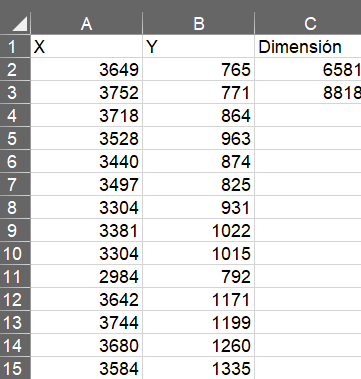
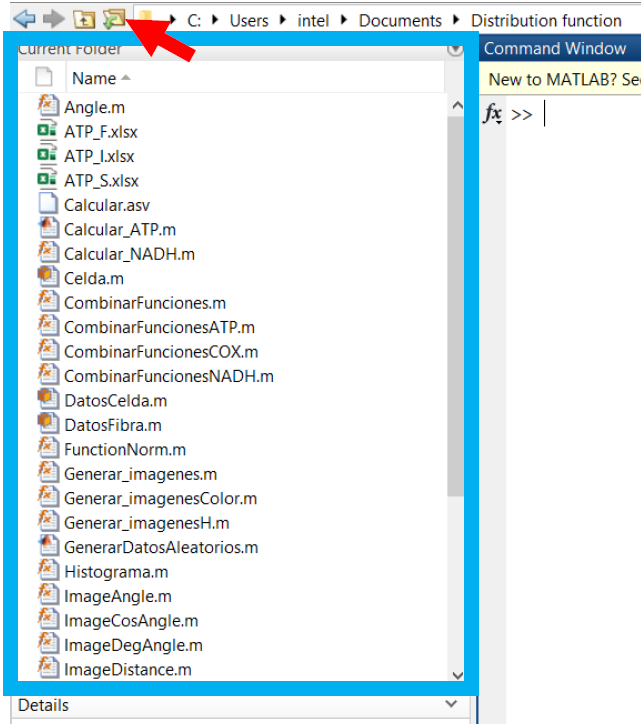
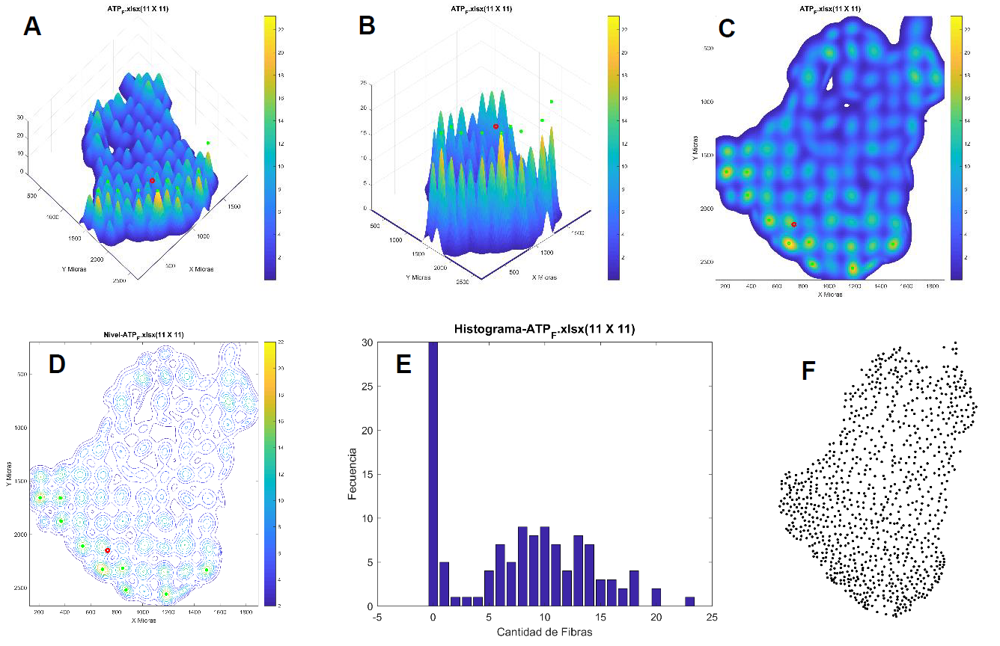
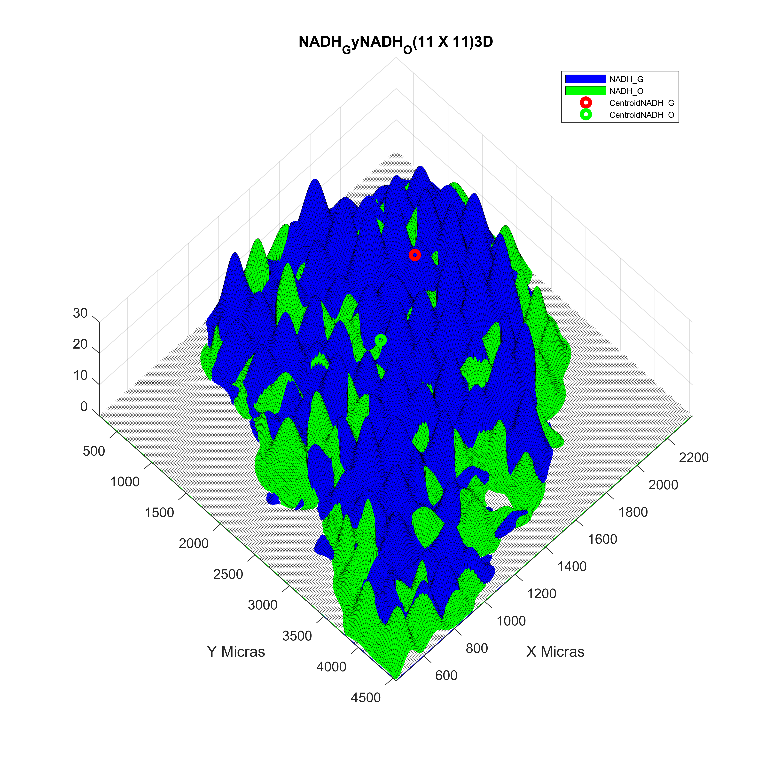
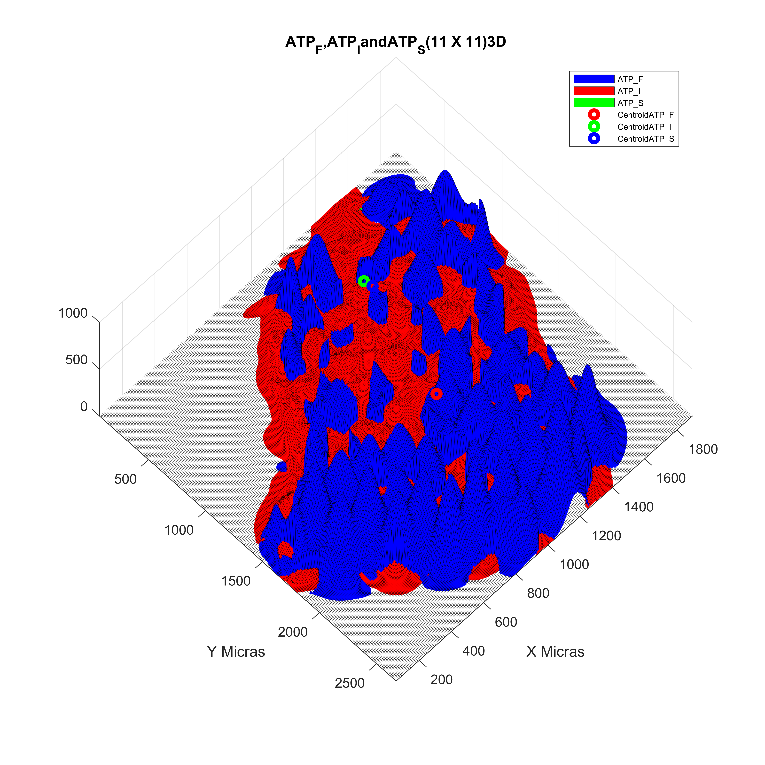
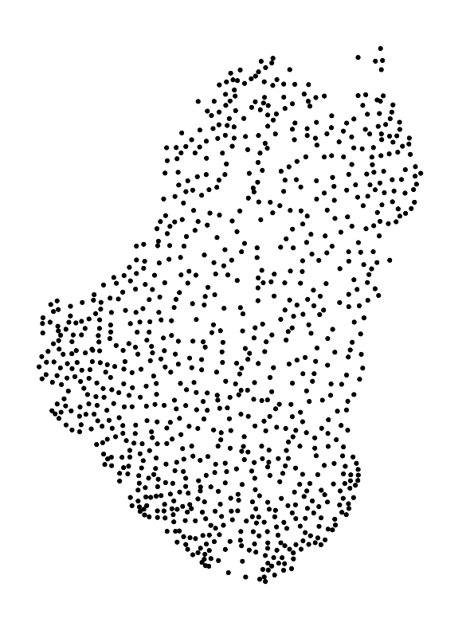
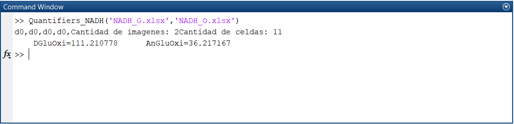
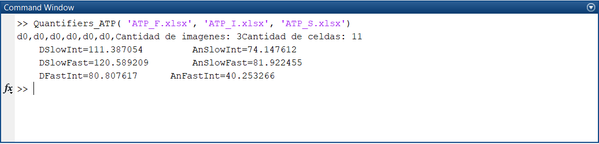

# DistributionFunctions
All Matlab functions require Excel files containing the (x, y) coordinates and the image size, in pixels, in the third column.



In Matlab change directory to the folder with the Excel files and scripts in this repository.



## Distribution function of a single file
1. Open Matlab and change directory to the folder with the Excel file and the files here uploaded.
2. Write in the Matlab command window the following instruction:
``` [Matlab]
M = Malla(file,size,res,show,save,VXY,zoom)
``` 

Where M is the name of the Malla object.
The argument *file* is the name of the Excel file to analyze, it must be written between apostrophes, e.g., 'fibras.xls'.
The argument *size* is the cell size, we use 11 to the experiments. 
*res* is a technical argument, 200 works fine. 
*show* and *save* are Boolean arguments to show to screen and save the functions, respectively.
The argument *VXY* can be used when the domain of a function to graph is known, which is used when two distribution functions are combined into a single graph. If it is only to one file, must be written 'null'.
'zoom' is to indicate the magnification of the objective with which the photograph was taken, in order to convert from pixels to microns. This argument can be '4x', '10x' or 'default'.
An example of correct instruction in the command window is:
```Matlab
M = Malla('C5NadhOscuros.xls',11,200,'false','false','null')
```


## Combine two functions in a single graph
1. Open Matlab and change directory to the folder with the Excel files and file here uploaded.
2. Write in the Matlab command window the following instruction:
```Matlab
h = CombinarFuncionesNADH(File1,File2,size,res)
```
Where *File1* and *File2* are the names of the first and second Excel files to be analyzed.
The argument *size* is the cell size, we have been using 11.
*res* is a technical argument, 200 works fine.

An example of correct instruction in the command window is:
```Matlab
h = CombinarFuncionesNADH('219mPcATP-oxidativas.xls','219mPcATP-glucoliticas.xls',11,200);
```
This method saves for default a .fig file, which can be open in Matlab to edit the image, and a .png image.




## Combine three function in a single graph
1.	Open Matlab and change directory to the folder with the Excel files and file *CombinarFuncionesATP.m* here uploaded.
2.	Write in the Matlab command window the following instruction:
```Matlab
h = CombinarFuncionesATP(Archivo1,Archivo2,Archivo3,num,res,zoom)
```
Where *Archivo1*, *Archivo2* and *Archivo3* are the names of the first, second, and third Excel files to be analyzed.
The argument *num* is the cell size, we have been using 11.
*res* is a technical argument, 200 works fine, and *zoom* is to indicate the magnification of the objective with which the photograph was taken, in order to convert from pixels to microns. This argument can be '4x', '10x' or 'default'.

An example of correct instruction in the command window is:
```Matlab
h = CombinarFuncionesATP('ATP_F.xlsx', 'ATP_I.xlsx', 'ATP_S.xlsx', 11, 200, '10x')
```


## Create binary images from a coordinates database
1.	Open Matlab and change directory to the folder with the Excel files and file *Generar_imagenes.m* here uploaded.
2.	Write in the Matlab command window the following instruction:
```Matlab
Generar_imagenes(archivo,tam)
```
Where *archivo* is the name of the Excel file containing the (x,y) coordinates. This file must contain the image size, in pixels, in the third column.
*tam* is the dot size to graph in the image.

An example of correct instruction in the command window is:
```Matlab
Generar_imagenes('219mPcATP-oxidativas.xls',5)
```



## Generate binary images from coordinates databases from a single file
1.	Open Matlab and change directory to the folder with the Excel files and file here uploaded.
2.	Write in the Matlab command window the following instruction:
```Matlab
Generar_imagenesM(archivo,tam,hoja)
```
Where *archivo* is the name of the Excel file containing the (x,y) coordinates.
*tam* is the dot size to graph in the image and *hoja* is the name of the sheet in the Excel file.
Each sheet must contain the image size, in pixels, in the third column.

An example of correct instruction in the command window is:
```Matlab
Generar_imagenesM('219mPcATP.xls',5,'Oxidativas'
```


## Dissimilarity quantifiers for two functions
1.	Open Matlab and change directory to the folder with the Excel files and file here uploaded.
2.	Write in the Matlab command window the following instruction:
```Matlab
Quantifiers_NADH(File1 , File2)
```

Where *File1* and *File2* are the Excel files containing the (x,y) coordinates of glycolytic and oxidative fibers, respectively.

An example of correct instruction is:
```Matlab
Quantifiers_NADH('NADH_G.xlsx','NADH_O.xlsx')
```




## Dissimilarity quantifiers for three functions
1.	Open Matlab and change directory to the folder with the Excel files and file here uploaded.
2.	Write in the Matlab command window the following instruction:
```Matlab
Quantifiers_ATP(File1 , File2 , File3)
```
Where *File1*, *File2*, and *File3* are the Excel files containing the (x, y) coordinates of fast, intermediate, and slow fibers, respectively.

A correct instruction in the command windows is:
```Matlab
Quantifiers_ATP('ATP_F.xlsx','ATP_I.xlsx','ATP_S.xlsx')
```


